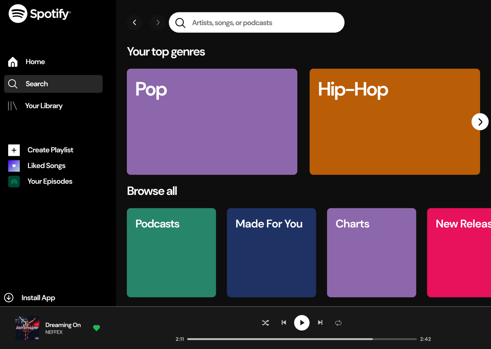

# Spotify Clone (Replica)
### link: https://sagar-sharma-7.github.io/Replica1-Spotify

### This is a replica/clone of spotify website.
### ```NOTE: Replica is event organised by OSS Club of AIT Pune.```

-----
### Given Design to replicate


----


<p float="left">

 
 

</p>
<hr>
<hr>

## Fonts used in Color Palette
```css 

@import url("https://fonts.googleapis.com/css2?family=Poppins:wght@300;400;500;600&display=swap");

body{
    font-family: "Montserrat", sans-serif;
}
```

 ## Cloning this repositary using command line
 1. Open **Git Bash**.
 1. Change the current working directory to the location where you want the cloned directory.
 1. Type `git clone https://github.com/Sagar-Sharma-7/Replica1-Spotify.git`
 1. Press **Enter** to create the clone of this repositary.

 -----
 -----
  ## How to reach me?
 [ ](mailto:0503sagarsharma@gmail.com)